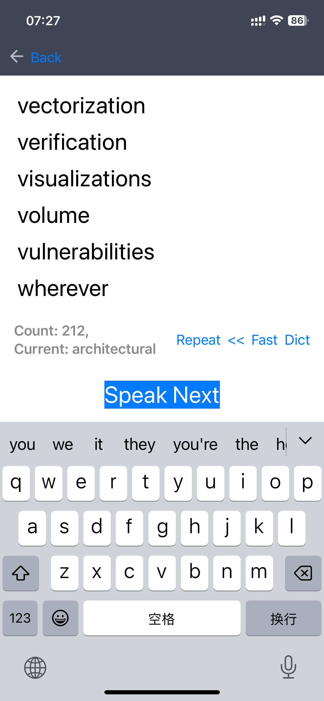

# HuluLLMEnglishLearn, 从你的生活当中学习英语, 随时随地背单词, 结合大模型来做对话训练

## 设计原则
* 和现实强相关,人类的进化就是来源于吃不饱但强相关生存的事情驱动的 =》 比如你在档口上班就是google meeting记录下来所有英文，然后你重复随时随地重复读; 比如刷的英文短剧视频，OCR下来整理出来学习列表
* 随时随地开发改进App本身，量身定制为自己, 自我设计, 让学习任何东西都变成可计算性的，可编程性的 => MMA计算论文思想
* 小龙哲学化表达语言，中心线几个词配合演讲其它的意思: 大学时演讲的关键性语言突破, 语言本质就是Transformer自编码器重构/翻译(武术翻译到计算机), Transformer化学习
* 尽可能生活中的所有都替换成英文：比如英文写每日笔记，然后手机电脑都设置为英文，强迫自己地狱生存模式！代码注释都是全英文！=> 就像写代码一样的英文！

## 开发列表

- [x] 从笔记中提取不熟悉的单词，然后语音读出来，帮助记忆的界面
- [x] 可以点击单词翻译，或者调用三方的谷歌翻译
- [x] Markdown笔记中提取你的英语单词列表: `cat *.md | bb hulu_word.clj | sort` or `cat 浏览器文章.txt | bb hulu_word.clj | sort `
- [x] 能用跑起来，更加快(合一)的时候，将hulu_word.clj改写成swift,knowed-word.txt保持到iOS的sqlite数据库里面
- [x] 日常手机Google Meeting收集的cc字幕识别，然后GPT整理去重提取出来日常读了学习，#英语来源于日常 => google_meeting_cc_and_ocr.sh
- [x] 输入文章，然后过滤已知单词，然后给出未知单词的列表去给你背诵！=》适合于学习文章之前熟悉一些新的单词！=> 比如interviews问题的不熟悉单词是哪些，提取列表出来。=> hulu/hulu/Utils/ParseArticleNewWord.swift
- [x] 读了单词，可以点一下读一个句子，要背句子才行，不然记不住(lina)
- [x] input images or take photo and ocr it, then do ParseArticleNewWord.swift 
- [x] 熟悉的单词列表，每个人都不一样，所以需要存入数据库，记得越多，自己的数据库越大，先验知识 ,这样分享出去jiefu也可以用！背自己不熟悉的单词，还有扫码可以背不熟悉的单词！=> base hulunote knowed-words note's navs resolve this problem
- [x] 集成进来sqlite，记录knowed-word.txt列表
- [x] 输入文章，然后提取出来没有背过的单词，然后给你背！再直接一点就是输入URL，然后就直接iOS出来要背诵的单词列表！(readme的东西爬下来单词列表背一下！打印出来！=》langchain的英文描述，metagpt，llama的英文描述都要) => 修改hulu_word.swift输入输出都是单词数组就可以实现了, 然后input里面解析成为数组，还有emacs编辑已知记牢的单词列表，过滤一下就出来了。
- [ ] get report , every day remember how many words
- [ ] 增加voice读一个单词，识别出来最近背的词，查一下字典
- [ ] 增加voice读一个单词，识别出来最近背的句子，Transformer 词袋模型-填空问题
- [ ] 收集chatgpt使用英文的问题和返回的英语学习
- [ ] 收集谷歌搜索的提问和点击标记的英文句子学习
- [ ] 收集谷歌翻译过的记录去学习
- [ ] 导入新概念英语文本1-4册的数据库，migration从网上下载导入数据库 =》可以搜索场景来读听力
- [ ] 大的长的句子读了很难被记忆，变成简单短的句子描述，更加现实相关，有趣才容易被记忆，还有就是哲学化。
- [ ] 单词和句子的记忆遗忘曲线的设计
- [ ] 集成进来sqlite，可以保存点击背单词的speak次数
- [ ] 集成大模型ChatGPT来口语训练：QA对话练习, 从语音口语和听力着重入手 => 随时随地开发才能真正损之！无处不在渗透式学习 https://ai.google.dev/edge/mediapipe/solutions/genai/llm_inference/ios => let LlmInference 。或者是phi2也能跑在移动端上面, 可以试试ollama跑在termux上面
- [ ] Chrome浏览器收集: ChatGPT使用QA记录，以及谷歌实用英语搜索, 英文网页选中标记Markdown=>ChromeZshrc
- [ ] 基于你的英语笔记做RAG应用: 使用[LlamaIndex](https://github.com/run-llama/llama_index), 可以用英文提问你的笔记，你和笔记进行对话，然后这个QA列表就是你学习这篇文章的主要记录，可多次复用到其他地方
- [ ] 基于ollama来fine-tuning自己语料使得回答更加接近你的词汇量，熟悉的表达方式和词汇，[[让单词有树可以生长]]
- [ ] 手机截图里面的英语学习，OCR识别写到sqlite里面，可以从表里面提取出来要学习的单词的列表
- [ ] 语音录音识别英语的现场出现的新单词提取出来学习
- [ ] iPhone上面跑起来Phi3微软手机上都可以跑起来的模型，本地做QA英文对话, 让过程变得强交互好玩，上下文中记忆单词(yilu)
- [ ] 出入境的基本口语听力的列表库
- [ ] 做外贸的基本口语听力的列表库： 价格，材质形容，基本寒暄。

## [iOS客户端视频演示](https://raw.githubusercontent.com/chanshunli/HuluLLMEnglishLearn/master/demo.MP4)
* 请查看项目的demo.MP4文件

